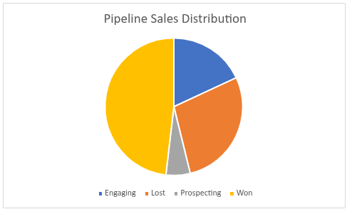
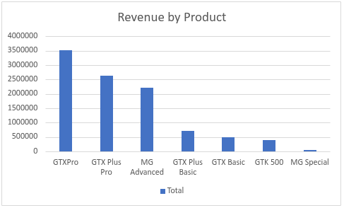
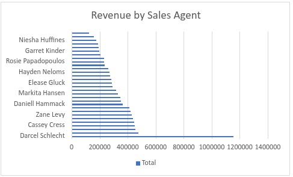

# CRM Sales Opportunities Dashboard

## Project Overview
This project analyzes CRM sales pipeline data to evaluate sales performance, revenue distribution, and sales team effectiveness.

The goal of the analysis was to identify top-performing sales agents, most profitable products, and overall deal conversion performance.

## Dataset
The dataset contains sales pipeline records including:

- Opportunity ID
- Sales agent
- Product
- Account
- Deal stage
- Engage date
- Close date
- Close value

Total opportunities analyzed: 8,800

## Tools Used
- Microsoft Excel
- Pivot Tables
- Data Filtering
- Data Visualization

## Analysis Performed

Key metrics analyzed include:

- Total revenue generated
- Number of deals by stage (Won, Lost, Engaging, Prospecting)
- Revenue by sales agent
- Revenue by product
- Monthly revenue trends

## Key Insights

- Total revenue from won deals: **$10,005,534**
- Highest revenue-generating product: **GTXPro**
- Top sales agent: **Darcel Schlecht**
- Win rate calculated at approximately **63.15%**

These insights help identify top-performing agents and products that drive the most revenue.

## Dashboard Visualizations

The dashboard includes visualizations for:

- Deal stage distribution
- Revenue by sales agent
- Revenue by product
- Monthly revenue trends

## Files

crm_sales_dashboard.xlsx → Excel dashboard  

